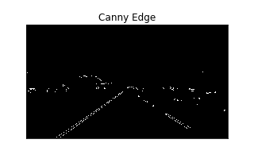

#**Finding Lane Lines on the Road** 

Overview
---

This is first project for the Self-Driving Car Nanodegree (SDCND), finding lanes on several roads in images and videos.

Lane Finding Pipeline
---

To identify and indicate the relevant lines I used the following pipeline.

1. Convert the image to greyscale. First I used the provided function averaging over the 3 channels RGB. Due to the reason, that the yellow lines weren't correctly detected (especially in challenge) I switched to just use the red channel.

2. Apply a Gaussian blur to smoothen the picture.

3. Apply Canny edges to detect edges in the picture.

4. Apply a mask over the designated area of lines in front of the vehicle.

5. Run Hough transformation and run the revised draw_lines(). There the lines are classified into right and left lines. For each class the average of slope and offset (or intercept) is calculated and handed over to the equation for a line. To handle the increased size of the challenge video the image.shape() is also handed over to this function to get the boundaries of the picture correctly.

6. Finally the lines are shown in an overlay with the inital picture / video.

